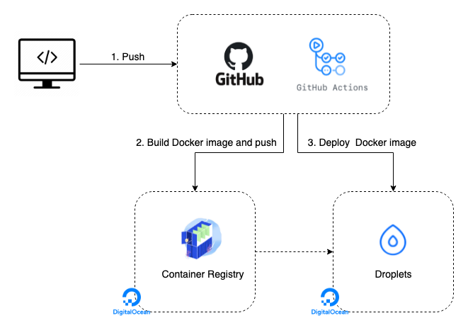

# Virus Total Fortinet - Didier Frank

Technologies used: Python, Docker (to containerize the application), Flask (for web application) , Redis (for message broker) , celery (running asynchronous task), postgres (for database), Linux, Gitpod (for running environment).

## System Architecture


## To run the project locally

Make sure you have Python and Docker (the container will install all required dependencies for you directly) installed, go to the directory containing the project and run below command (however, it's advised to use Gitpod for conveniency):

```sh
$ docker-compose up --build
```

## To run the project via Gitpod

You can access/use Gitpod platform via gitlab directly. More info on Gitpod click [here](https://gitpod.io/workspaces).
Gitpod is the easiest way to run this application.
After opening the source code project in Gitpod, go to terminal and copy-paste below command to start the container:

```sh
$ docker-compose up --build
```

Open your browser to [http://localhost:5004](http://localhost:5004) to view the app or to [http://localhost:5556](http://localhost:5556) to view the Celery Flower dashboard.

Trigger a new task:

```sh
$ curl http://localhost:5004/tasks -H "Content-Type: application/json" --data '{"type": 0}'
```

Check the status:

```sh
$ curl http://localhost:5004/tasks/<TASK_ID>/
```

To watch the video Demo, you can watch/download from my dropbox account: [Click here](https://www.dropbox.com/s/gza7897tj3gzvoc/Virus_Total_Demo_DidierFrank.mov?dl=0)

## Deployment

To deploy this project on internet, I used below workflow via Digital Ocean:



Documentation on how to deploy this project using Digital Ocean: [Here](https://faun.pub/full-ci-cd-with-docker-github-actions-digitalocean-droplets-container-registry-db2938db8246)

## Access Live Website

To access the live application on internet, please follow below:

-Accessing website homepage, click [here](http://143.110.209.57:5004/)

-Accessing celery flower dashboard, click [here](http://143.110.209.57:5556/)

## Author
Isingizwe Didier Frank 
